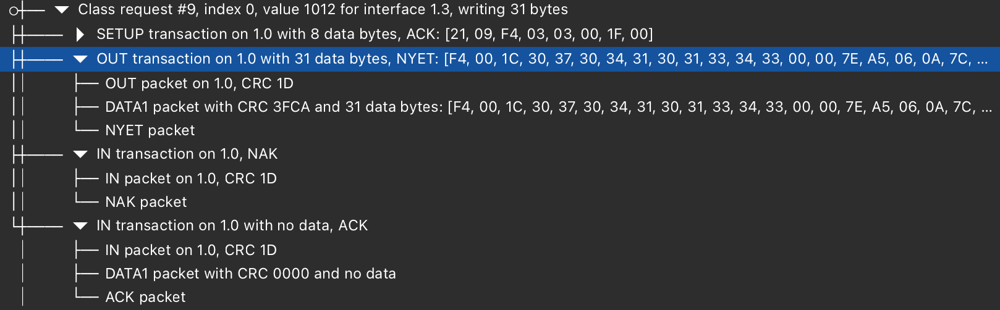

# cynthionwhisperer-cli

Python CLI project that uses the `cynthionwhisperer` PyO3 extension built from the sibling Rust workspace.

## Quick start

```bash
./scripts/dev_setup.sh
source .venv/bin/activate
cwcli capture --speed auto
```

Match any incoming DATA packet with payload starting `0x20`:

```bash
cwcli capture --speed auto --direction in --pattern-hex 20
```

Match only incoming `DATA1` with payload starting `0x20`:

```bash
cwcli capture --speed auto --direction in --data-pid data1 --pattern-hex 20
```

Low-level polling API (for custom matching logic):

```python
import cynthionwhisperer

c = cynthionwhisperer.Cynthion.open_first()
cap = c.start_capture("auto")
try:
    while True:
        state, item = cap.poll_next(timeout_ms=0)
        if state == "timeout":
            continue
        if state == "ended":
            break
        if state == "event" and hasattr(item, "bytes"):
            # item is a Packet; inspect item.bytes and item.timestamp_ns
            pass
finally:
    cap.stop()
```

## Trigger commands

Configure stage 0 for a fixed-offset byte pattern, enable trigger output, and arm:

```bash
cwcli trigger-config \
  --stage-index 0 \
  --offset 68 \
  --pattern-hex "00 32 52 95 FE" \
  --stage-count 1 \
  --arm
```

or a more complex sequence which should match the following class request #9 (HID feature request):


```

## Setup to trigger after a SET_REQUEST with the following parameters has been ACKed
# 1 = bmRequestType (21)
# 2 = bRequest (09)
# 3..4 = wValue (F4 03, little-endian)
# 5..6 = wIndex (03 00)
# 7..8 = wLength (1F 00)

## SETUP packet
cwcli trigger-config \
  --stage-index 0 --offset 1 --pattern-hex "21 09 F4 03 03 00 1F 00" --stage-count 6

## DATA1 packet with payload
cwcli trigger-config \
  --stage-index 1 --offset 1 --pattern-hex "F4 00 1C 30 37 30 34" --stage-count 6

## NYET packet in the same OUT transaction
cwcli trigger-config \
  --stage-index 2 --offset 0 --pattern-hex "96" --stage-count 6

## IN transaction
cwcli trigger-config \
  --stage-index 3 --offset 0 --pattern-hex "69" --stage-count 6

## DATA1 packet with CRC 0000
cwcli trigger-config \
  --stage-index 4 --offset 0 --pattern-hex "4B" --stage-count 6

## Final ACK packet
cwcli trigger-config \
  --stage-index 5 --offset 0 --pattern-hex "D2" --stage-count 6 --arm
```

Read trigger status:

```bash
cwcli trigger-status --print-caps
```

Read back one stage configuration:

```bash
cwcli trigger-get-stage --stage-index 0
```

Disarm trigger:

```bash
cwcli trigger-disarm
```

## Target power control

Read current target power state and supported sources:

```bash
cwcli target-power status
```

Turn target power on (source examples: `target-c`, `control`, `aux`, `host`):

```bash
cwcli target-power on --source target-c
```

Turn target power off:

```bash
cwcli target-power off --source target-c
```

Power cycle target (on for 500 ms, then off):

```bash
cwcli target-power cycle --source target-c --delay-ms 500
```

## Notes

- `scripts/dev_setup.sh` builds and installs the extension from:
  - `cynthionwhisperer-rs/crates/cynthionwhisperer-py/Cargo.toml`
